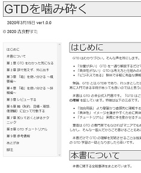
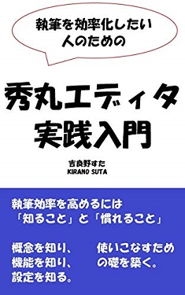
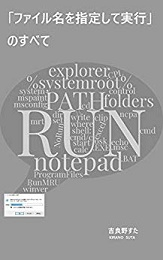

## プロフィール
1988 年、広島県生まれ。大手のソフトウェア企業に勤める傍ら、「知的生産や自己管理の技術」や「働き方の改善・向上」を探求している。

## :book: 著書リスト
| 表紙 | リンク |
| ---- | ------ |
|  | 2022/04/21 [Scrapboxing(スクラップボクシング) ](https://www.amazon.co.jp/gp/product/B09YLFQZ29) Keywords: Scrapbox, コミュニケーションパターン |
|  | 2020/04/09 [ミニマリズムの教科書](https://www.amazon.co.jp/dp/B086WR1YDZ) Keywords: ミニマリズム, ミニマリスト |
|  | 2020/03/15 [GTDを噛み砕く](https://stakiran.github.io/gtd_kamikudaku/) Keywords: GTD, オンラインドキュメント |
|  | 2020/02/09 [あなたのパソコンが重い理由　～1日3時間を取り戻す方法～](https://www.amazon.co.jp/gp/product/B084LV7JVV/) Keywords: Windows, 時短, 高速化 |
|  | 2019/04/27 [執筆を効率化したい人のための秀丸エディタ実践入門](https://www.amazon.co.jp/gp/product/B07R6FTSMT/) Keywords: 執筆の効率化, テキストエディタ, 秀丸エディタ |
|  | 2019/01/13 [ルーチンタスクの底力: やり忘れとストレスをなくす仕組みと実践](https://www.amazon.co.jp/gp/product/B07MJW8MVD/) Keywords: タスク管理, ルーチンワーク |
|  | 2018/10/13 [「ファイル名を指定して実行」のすべて](https://www.amazon.co.jp/gp/product/B07JF3BHP5/) Keywords: Winbows, ショートカット, カスタマイズ, コマンドライン |

## :email: お問い合わせ
- Twitter: [@stakiran2](https://twitter.com/stakiran2)
- その他の手段については [お問い合わせ - stakiran研究所](https://scrapbox.io/sta/%E3%81%8A%E5%95%8F%E3%81%84%E5%90%88%E3%82%8F%E3%81%9B) をご覧ください
