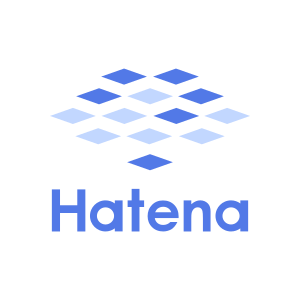

| 開始日     | タイトルとリンク | ジャンル | キーワードや一言解説 |
| ---------- | ---------------- | -------- | ---------- |
| 2019/07/13 | [alauncher](https://github.com/stakiran/alauncher) | プログラムランチャー | pushd のエイリアス pd など、自由なエイリアス作成を可能にする上級者向けツール |
| 2019/07/10 | [statil](https://statil.hatenablog.com/) | ブログ | TIL(Today I Learned), 雑記, 備忘録 |
| 2019/04/26 | [Amazon.co.jp： 執筆を効率化したい人のための秀丸エディタ実践入門](https://www.amazon.co.jp/dp/B07R6FTSMT) | 電子書籍 | テキストエディタ |
| 2019/03/10 | [todochute](https://stakiran.github.io/todochute-releases/) | タスク管理 | TaskChute と todo.txt を足して二で割ったようなタスク管理ツール |
| 2019/02/23 | [Monolithic](https://stakiran.github.io/monolithic/) | ウェブサイト | 研究, 持論, 仕事術 |
| 2019/01/11 | [ルーチンタスクの底力: やり忘れとストレスをなくす仕組みと実践](https://www.amazon.co.jp/dp/B07MJW8MVD) | 電子書籍 | タスク管理 |
| 2018/12/21 | [houtliner](https://github.com/stakiran/houtliner) | テキスト | 日本語で書くことを前提に設計された、秀丸エディタ上で動作する 2 ペインアウトライナー |
| 2018/10/27 | [ストレスフリーなソロ充ライフ](https://stressfree-fulfilling-solo.hatenablog.com/) | ブログ | 雑記ブロガー, ライフハック, 多趣味 |
| 2018/10/20 | [「ファイル名を指定して実行」のすべて](https://www.amazon.co.jp/dp/B07JF3BHP5/) | 電子書籍 | Windows |
| 2018/07/03 | [タスク管理に恋してる](https://ilovetaskmanagement.hatenablog.com/) | ブログ | タスク管理, 概念, 理論, ツール |
| 2018/04/11 | [incl](https://github.com/stakiran/incl) | プログラムランチャー | インクリメンタルサーチ型ランチャー、一行一アイテムでファイルフォルダパスや URL を書く |
| 2017/09/14 | [stamemo](http://stakiran.hatenablog.com/) | ブログ | ソフトウェア技術, 備忘録 |
| 2017/07/29 | [Tritask](https://tritask.github.io/tritask-web/) | タスク管理 | テキストエディタでガシガシ編集する、ストレスフリーなタスク管理ツール |
| 2017/07/09 | [intoc](https://github.com/stakiran/intoc) | テキスト | Markdown ファイルの TOC(目次) を生成するツール、GFM 対応 |
| 2017/06/26 | [cmdmarks](https://github.com/stakiran/cmdmarks) | プログラムランチャー | コマンドプロンプト上で使えるディレクトリブックマークツール |

     

2019 © stakiran
