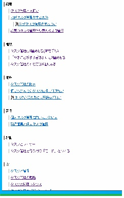

## :book: 著書リスト

| 表紙 | リンク |
| ---- | ------ |
|  | 2025/03/24 [Remotism](https://zenn.dev/sta/books/remotism-book) Keywords: リモートワーク, オンラインドキュメント |
|  | 2024/09/11 [タスク管理を噛み砕く](https://zenn.dev/sta/books/taskmanagement-kamikudaku) Keywords: タスク管理, オンラインドキュメント |
|  | 2024/05/29 [SBOMを噛み砕く](https://zenn.dev/sta/books/sbom-kamikudaku) Keywords: SBOM, オンラインドキュメント |
|  | 2024/04/02 [Workware Engineering](https://zenn.dev/sta/books/workware-engineering) Keywords: 概念的道具, メタワーク |
|  | 2022/12/17 [とあるタスク管理マニアの結論](https://tms1.vercel.app/) Keywords: タスク管理, 箇条書きとリンク, オンラインドキュメント |
|  | 2022/04/21 [Scrapboxing(スクラップボクシング)](https://www.amazon.co.jp/gp/product/B09YLFQZ29) Keywords: Scrapbox, コミュニケーションパターン |
|  | 2020/04/09 [ミニマリズムの教科書](https://www.amazon.co.jp/dp/B086WR1YDZ) Keywords: ミニマリズム, ミニマリスト |
|  | 2020/03/15 [GTDを噛み砕く](https://stakiran.github.io/gtd_kamikudaku/) Keywords: GTD, オンラインドキュメント |
|  | 2019/04/27 [執筆を効率化したい人のための秀丸エディタ実践入門](https://www.amazon.co.jp/gp/product/B07R6FTSMT/) Keywords: 執筆の効率化, テキストエディタ, 秀丸エディタ |
|  | 2019/01/13 [ルーチンタスクの底力: やり忘れとストレスをなくす仕組みと実践](https://www.amazon.co.jp/gp/product/B07MJW8MVD/) Keywords: タスク管理, ルーチンワーク |
|  | 2018/10/13 [「ファイル名を指定して実行」のすべて](https://www.amazon.co.jp/gp/product/B07JF3BHP5/) Keywords: Winbows, ショートカット, カスタマイズ, コマンドライン |

## :email: お問い合わせ
- Twitter: [@stakiran2](https://twitter.com/stakiran2)
- Mail: [お問い合わせフォーム](https://forms.gle/VPnemhHTKLsGnyQc8)
