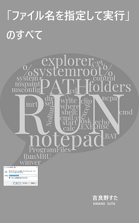

## プロフィール
1988 年、広島生まれ。大手のソフトウェア企業に勤める傍ら、知的生産や自己管理を探求している。座右の銘は「ストレスフリー」と「ベストエフォート」。

## 著書リスト

| 表紙 | リンク |
| ---- | ------ |
|  | 2020/02/09 [あなたのパソコンが重い理由　～1日3時間を取り戻す方法～](https://www.amazon.co.jp/gp/product/B084LV7JVV/) Keywords: Windows, 時短, 高速化 |
|  | 2019/04/27 [執筆を効率化したい人のための秀丸エディタ実践入門](https://www.amazon.co.jp/gp/product/B07R6FTSMT/) Keywords: 執筆の効率化, テキストエディタ, 秀丸エディタ |
|  | 2019/01/13 [ルーチンタスクの底力: やり忘れとストレスをなくす仕組みと実践](https://www.amazon.co.jp/gp/product/B07MJW8MVD/) Keywords: タスク管理, ルーチンワーク |
|  | 2018/10/13 [「ファイル名を指定して実行」のすべて](https://www.amazon.co.jp/gp/product/B07JF3BHP5/) Keywords: Winbows, ショートカット, カスタマイズ, コマンドライン |

## リンク集
- [stakiran(エンジニアとしての吉良野すた)はこちら](index_as_software_engineer.md)
- [お問い合わせ](contact.md)
