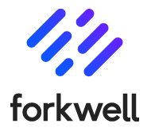

## :muscle: Career
新卒で大手のソフトウェア会社に入社して以来、エンジニアとして色んな仕事や部署を渡り歩いている。

主な戦歴:

- 2012/10 クラスタウェアのロギング機構の開発(1.5年)
  - C++0x, Google Test
  - 全モジュールから利用され、安定性と性能の両立が求められるロギング機構
  - OOP と TDD により品質を担保
  - C++ のリファレンスを読み、検証も行いながらスレッドセーフを担保
- 2014/01 ネットワーク運用管理ソフトウェアの評価支援(0.2年)
  - Python, Wireshark, psql
  - パケットやデータベースの検証をスクリプトによりコマンドラインで自動化
  - 評価工数を 1/30 に短縮し、納期内の完遂に貢献
- 2015/10 オープンデータを用いた新規事業の検討(0.5年)
  - Python, REST API, Heroku, e-Stat, Sphinx
  - 事業化には至れなかったものの、REST API を用いたアプリ開発とドキュメント共有の知見を共有
- 2018/02 Excel VBA サイジングツールの Web アプリ化(1.7年)
  - Python, Javascript, HTML/CSS, mocha/chai, MkDocs
  - ドメインもロジックも難解な Excel VBA アプリケーションで、移植は困難とされていた
  - 挙動だけ移植する、サーバーサイドはつくらずフロントで完結させる、データは csv to js してフロントに持たせる、など工夫を重ねて、移植可能なボリュームにまで落とし込む
  - OOP、TDD、BDD、Slack ベースの迅速なコミュニケーション、MkDocs によるドキュメント一元化など手法も工夫＆浸透させ、一年以上遅延無しかつ毎日定時退社で完遂
- 2019/04 AWS 評価環境の自動構築(3ヶ月)
  - AWS CloudFormation
  - 何十回と構築することになる評価環境、一回につき 60 分を要していたが、うち前半部分の 30 分を 3 分にまで短縮
  - CloudFormation や IaC の解説も含めてドキュメント化を行い、チーム内の自動化文化と知見向上に貢献
- 2019/12 IaC 学習環境の構築(3ヶ月)
  - AWS CloudFormation, CodeCommit, Lambda, Ansible
  - レガシーな SI 部門の学習支援のため「かんたんに IaC を試せる環境」を構築
  - 利用者ごとに専用の環境を払い出す仕組みで、AWS と Ansible の活用により、ほぼ自動で構築可能
  - ダブルクリックだけでログイン可能、料金過多を防ぐインスタンス電源制御、踏み台セキュリティなど諸々のハードルもクリアしており知見としても共有
- 2020/04 新規事業検討とプロセス整備(2ヶ月)
  - 新規事業について右も左もわからない事業部に対し、以下の活動にて方向性を示した
  - リーンスタートアップや顧客開発モデルなどの書籍を読み込み、[Scrapbox](https://scrapbox.io/sta-leanstartup/) や GitLab Wiki で整備
  - 同上の理論と自社の事情も考慮した、自社用新規事業プロセスのたたき台を作成
  - 今回の検討過程をすべて GitLab に残し、誰でも閲覧できるように整備

## :point_up: Personal
- 地頭と要領は人並以下ですが、その分やり方・考え方・スタンスを工夫しています
- ストレングス・ファインダーは次のとおりです
  - 1: 戦略性
  - 2: 指令性
  - 3: 自我
  - 4: 内省
  - 5: 収集心
  - 強いのは「戦略的思考力(考えたい)」「影響力(影響を与えたい)」です
  - 逆に「人間関係構築力(対人関係を築きたい)」「実行力(物事を成し遂げたい)」は得意としません

## :email: Contact
- [お問い合わせ](contact.md)
