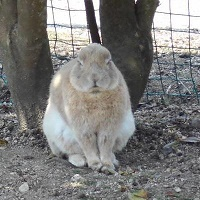
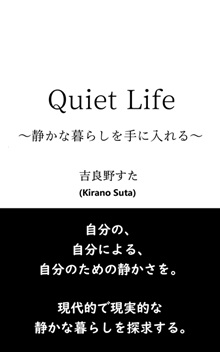
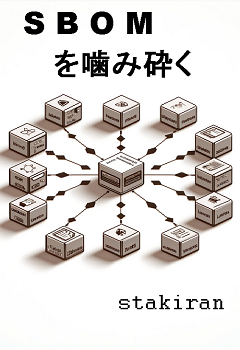
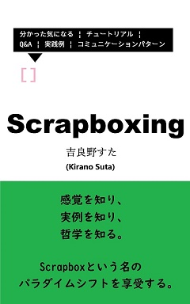
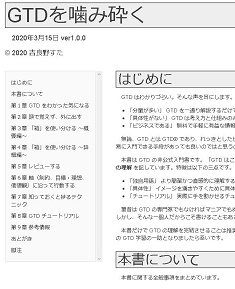
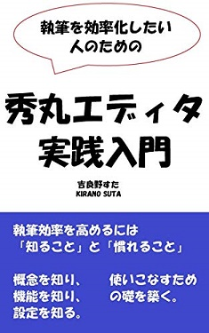
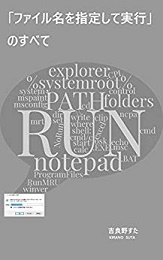

# 自己紹介
吉良野すた

ASD x IT x ソロの世界観と、そこから生み出された利便性をお届けします。

本業は IT エンジニアです。ニューロダイバージェント（ASD）としての不便を軽減するために IT とソフトスキルを重用しており、その学びをアウトプットしています。

## 著書リスト

| 表紙 | リンク |
| ---- | ------ |
|  | 2025/10/20 [Quiet Life ～静かな暮らしを手に入れる～](https://www.amazon.co.jp/dp/B0FX39RLWS) 静かな暮らし, 静かな退職, ミニマリズム, 独身, 孤独 |
|  | 2024/09/11 [タスク管理を噛み砕く](https://zenn.dev/sta/books/taskmanagement-kamikudaku) タスク管理 |
|  | 2024/05/29 [SBOMを噛み砕く](https://zenn.dev/sta/books/sbom-kamikudaku) SBOM, オンラインドキュメント |
|  | 2022/04/21 [Scrapboxing(スクラップボクシング)](https://www.amazon.co.jp/gp/product/B09YLFQZ29) Scrapbox, コミュニケーションパターン |
|  | 2020/04/09 [ミニマリズムの教科書](https://www.amazon.co.jp/dp/B086WR1YDZ) ミニマリズム, ミニマリスト |
|  | 2020/03/15 [GTDを噛み砕く](https://stakiran.github.io/gtd_kamikudaku/) GTD, オールインワン |
|  | 2019/04/27 [執筆を効率化したい人のための秀丸エディタ実践入門](https://www.amazon.co.jp/gp/product/B07R6FTSMT/) 執筆の効率化, テキストエディタ, 秀丸エディタ |
|  | 2019/01/13 [ルーチンタスクの底力: やり忘れとストレスをなくす仕組みと実践](https://www.amazon.co.jp/gp/product/B07MJW8MVD/) タスク管理, ルーチンワーク |
|  | 2018/10/13 [「ファイル名を指定して実行」のすべて](https://www.amazon.co.jp/gp/product/B07JF3BHP5/) Winbows, ショートカット, カスタマイズ, コマンドライン |

## ブログ
2024～: [Cosense: stao](https://scrapbox.io/stao/)

| 時期 | リンク |
| ---- | ------ |
| 2017-2020 | [stamemo](https://stakiran.hatenablog.com/) はてなブログ IT、備忘録 |
| 2017-2019 | [Qiita @sta](https://qiita.com/sta) Qiita IT、初心者向け、エンタメ |
| 2018-2021 | [ガラパゴスタ](https://stressfree-fulfilling-solo.hatenablog.com/) はてなブログ ライフハック x ソロ志向 |
| 2025 | [DEV Community @sta](https://dev.to/stakiran) Dev Community IT x ソフトスキル x 英語 |
