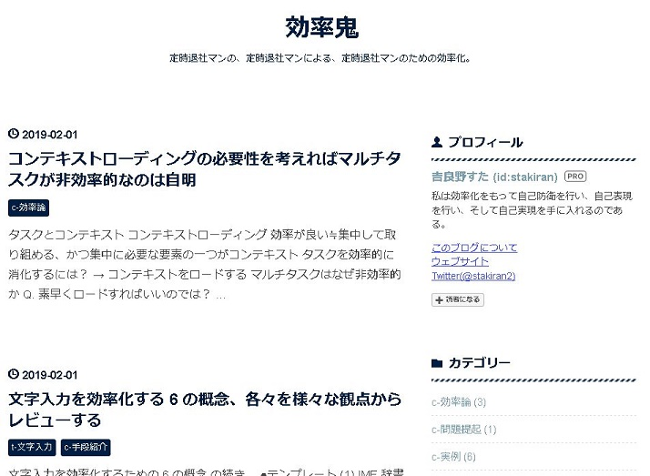

# 吉良野すたプロフィール

アバターには大久野島で撮ったうさぎさんを使っています。

## ブログ
2019/02 現在、4 本のブログを運営しています。

### ストレスフリーなソロ充ライフ

[https://stressfree-fulfilling-solo.hatenablog.com/](https://stressfree-fulfilling-solo.hatenablog.com/)

メインブログ。ストレスフリーガチ勢を掲げ、ソロ充・毎日定時退社・多趣味などを主軸にした雑記ブログです。

- マニアック度: 低
- 更新度: 高

### stamemo

[http://stakiran.hatenablog.com/](http://stakiran.hatenablog.com/)

主にソフトウェア技術や仕事術に関して調べたこと、試したこと、つくったもの、考えたことなどを雑多に記した備忘録です。

- マニアック度: 中～高
- 更新度: 低～中

### 効率鬼

[https://kouritsuoni.hatenablog.com/](https://kouritsuoni.hatenablog.com/)

仕事のやり方、捉え方から道具の使い方まで、ストイックに効率化を追求した備忘録です。

- マニアック度: 高
- 更新度: 中

### タスク管理に恋してる

[https://ilovetaskmanagement.hatenablog.com/](https://ilovetaskmanagement.hatenablog.com/)

タスク管理に関する各種概念、理論、ツールなどについて調べたり試したり考えたりして楽しんでいるブログです。てっとり早く中身を知りたい方は 用語集 [stask - Scrapbox](https://scrapbox.io/stask/) もどうぞ。

- マニアック度: 高
- 更新度: 低

## 詳しいプロフィール
その他詳しいプロフィールにつきましては [このブログについて - ストレスフリーなソロ充ライフ](https://stressfree-fulfilling-solo.hatenablog.com/entry/2018/10/27/104349) をご覧ください。
