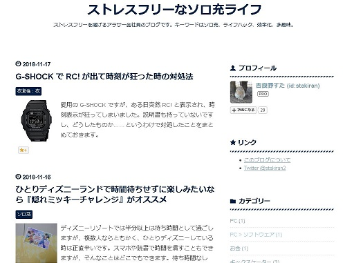
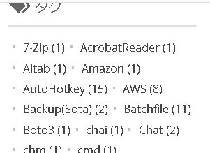
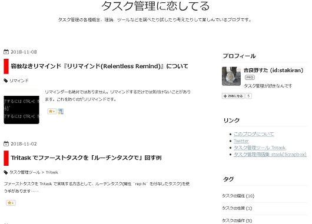

# 吉良野すたプロフィール

## ブログ

### ストレスフリーなソロ充ライフ

[https://stressfree-fulfilling-solo.hatenablog.com/](https://stressfree-fulfilling-solo.hatenablog.com/)

メインブログ。ソロ充、ライフハック、多趣味の三本柱を軸に、ストレスフリーな生き方を模索しています。

### stamemo

[http://stakiran.hatenablog.com/](http://stakiran.hatenablog.com/)

ソフトウェア技術や仕事効率化の備忘録です。常用している Windows, 秀丸エディタ, AutoHotkey, Python, Markdown, GitHub ネタが多めですが、割と色んなネタを扱っています。

### タスク管理に恋してる

[https://ilovetaskmanagement.hatenablog.com/](https://ilovetaskmanagement.hatenablog.com/)

タスク管理ネタが増えそうだったので別ブログをつくりました。タスク管理の各種概念、理論、ツールなどを調べたり試したり考えたりして楽しんでいるサブブログです。

## 詳しいプロフィール
その他詳しいプロフィールにつきましては [このブログについて - ストレスフリーなソロ充ライフ](https://stressfree-fulfilling-solo.hatenablog.com/entry/2018/10/27/104349) をご覧ください。
