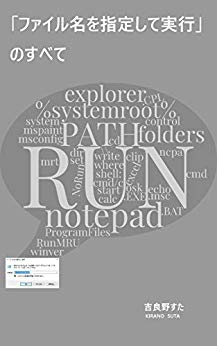

# Works

## 電子書籍

### 「ファイル名を指定して実行」のすべて

[Amazon.co.jp： 「ファイル名を指定して実行」のすべて eBook: 吉良野すた: Kindleストア](https://www.amazon.co.jp/dp/B07JF3BHP5/)

Windows の「ファイル名を指定して実行」について、実用的なテクニックから知られざる小ネタまでカバーした一冊です。Windows をもっと便利に使いたい方、操作効率を上げて仕事をスピードアップしたい方、Windows の仕組みや考え方を知りたい方、小ネタを集めたい方など、初心者から上級者まで幅広くお読みいただけます。

## タスク管理

### Tritask
[https://tritask.github.io/tritask-web/](https://tritask.github.io/tritask-web/)

執筆のように。プログラミングのように。テキストエディタでガシガシ編集するストレスフリーなタスク管理ツールです。

### Commainder
[GitHub - stakiran/commainder: ](https://github.com/stakiran/commainder)

バッチファイル謹製リマインダー。 `r 3 カップラーメン` を実行すると、3分後に「カップラーメン」と表示します。作業に集中しがちなエンジニアや作家さんでも、用事に忘れることなく気付けます。

## テキスト

### intoc
[GitHub - stakiran/intoc: TOC generator for Markdown.](https://github.com/stakiran/intoc)

Markdown ファイルの TOC(目次) を生成するツールです。

関連記事: [GitHub 上の Markdown が TOC(目次) を表示してくれないのでどうしようか → ツール自製したよって話 - Qiita](https://qiita.com/sta/items/9481c94e0fc36f27fa92)

### hidemaru markdown
[GitHub - stakiran/hidemaru_markdown](https://github.com/stakiran/hidemaru_markdown)

秀丸エディタで Markdown 執筆環境を整えるための設定( .hilight ファイル)です。基本的な文法のカラー表示と、見出しのアウトライン化（見出し単位でジャンプしたり目次を別枠で表示して俯瞰したりなど）に対応しています。

### hidemaru outliner
[GitHub - stakiran/hidemaru_outliner](https://github.com/stakiran/hidemaru_outliner)

秀丸エディタでアウトライナー(アウトラインプロセッサー)を実現します。指定した見出しを折りたたんだり、アウトライン解析枠の表示位置をワンタッチで変えたりすることができます。

## プログラムランチャー

### cmdmarks
[GitHub - stakiran/cmdmarks: Directory bookmarks for Windows Command Prompt](https://github.com/stakiran/cmdmarks)

コマンドプロンプト上で使えるディレクトリブックマークツールです。`cm add` でカレントディレクトリをブックマーク登録しておくと、`cm KEYWORD` や `cm 番号` などで指定ブックマークのディレクトリに一発アクセスできます。

### isb
[GitHub - stakiran/isb: Incremental Searchable Bookmarker.](https://github.com/stakiran/isb)

インクリメンタルサーチが可能なウェブサイトブックマークツールです。Markdown ファイルでリンクを書いておき、ビルドを行うと、インクリメンタルサーチ機能を備えた単一ページが生成されます。これをブックマークホームページとして利用します。

[サンプルはこちら](https://stakiran.github.io/isb/index.html)

### incl
[GitHub - stakiran/incl: A simple incremental searchable launcher for Windows.](https://github.com/stakiran/incl)

インクリメンタルサーチ型のプログラムランチャーです。一行一アイテムでファイルフォルダパスや URL を書いておくだけで、インクリメンタルサーチで引っ掛けることができます。任意のキーワードも登録できるので、「ファイル名を覚えてないと引っ掛けられない」ということもありません。
