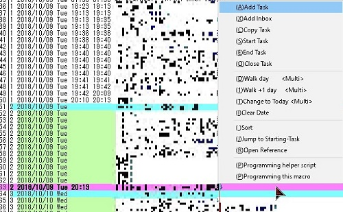
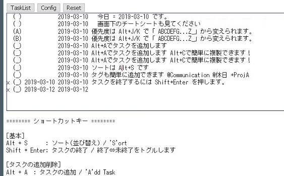
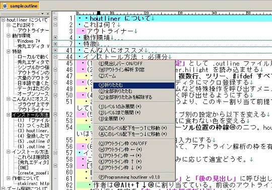
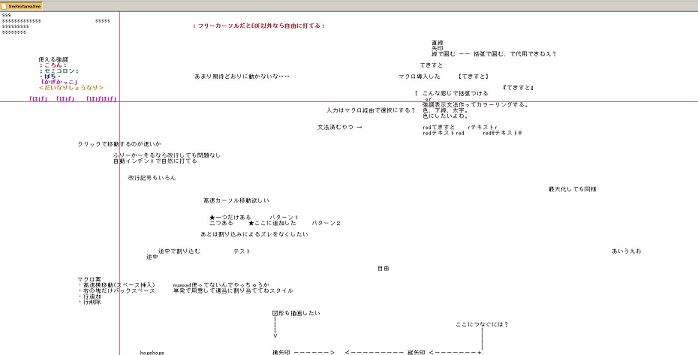

# 制作物(プログラム)
[制作物(書籍・記事) についてはこちら](works_writing.md)

## タスク管理

### Tritask

[https://tritask.github.io/tritask-web/](https://tritask.github.io/tritask-web/)

執筆のように。プログラミングのように。テキストエディタでガシガシ編集するストレスフリーなタスク管理ツールです。

### todochute

[https://stakiran.github.io/todochute-releases/](https://stakiran.github.io/todochute-releases/)

ブラウザから手軽に使えるタスク管理ツールです。todo.txt のフォーマットに TaskChute のソート機能を混ぜたような使い心地です。

### Commainder
[GitHub - stakiran/commainder: ](https://github.com/stakiran/commainder)

バッチファイル謹製リマインダー。 `r 3 カップラーメン` を実行すると、3分後に「カップラーメン」と表示します。作業に集中しがちなエンジニアや作家さんでも、用事に忘れることなく気付けます。

## テキスト

### intoc
[GitHub - stakiran/intoc: TOC generator for Markdown.](https://github.com/stakiran/intoc)

Markdown ファイルの TOC(目次) を生成するツールです。

関連記事: [GitHub 上の Markdown が TOC(目次) を表示してくれないのでどうしようか → ツール自製したよって話 - Qiita](https://qiita.com/sta/items/9481c94e0fc36f27fa92)

### houtliner

[GitHub - stakiran/houtliner: 軽くてパワフルなアウトライナーを、秀丸エディタで。](https://github.com/stakiran/houtliner)

秀丸エディタ上で動作する 2 ペインのアウトライナーです。日本語で書くために設計された、必要最小限の記法を採用しています。

### hidemaru_freetext

[GitHub - stakiran/hidemaru_freetext: ホワイトボードのような自由を、秀丸エディタで。](https://github.com/stakiran/hidemaru_freetext)

フリーカーソルという概念を用いた秀丸エディタ用の拡張機能です。手書きだと遅くて汚い、エディタだと空間配置に弱い……そんな両者の折衷案を目指しています。

## プログラムランチャー

### cmdmarks
[GitHub - stakiran/cmdmarks: Directory bookmarks for Windows Command Prompt](https://github.com/stakiran/cmdmarks)

コマンドプロンプト上で使えるディレクトリブックマークツールです。`cm add` でカレントディレクトリをブックマーク登録しておくと、`cm KEYWORD` や `cm 番号` などで指定ブックマークのディレクトリに一発アクセスできます。

### isb
[GitHub - stakiran/isb: Incremental Searchable Bookmarker.](https://github.com/stakiran/isb)

インクリメンタルサーチが可能なウェブサイトブックマークツールです。Markdown ファイルでリンクを書いておき、ビルドを行うと、インクリメンタルサーチ機能を備えた単一ページが生成されます。これをブックマークホームページとして利用します。

[サンプルはこちら](https://stakiran.github.io/isb/index.html)

### incl
[GitHub - stakiran/incl: A simple incremental searchable launcher for Windows.](https://github.com/stakiran/incl)

インクリメンタルサーチ型のプログラムランチャーです。一行一アイテムでファイルフォルダパスや URL を書いておくだけで、インクリメンタルサーチで引っ掛けることができます。任意のキーワードも登録できるので、「ファイル名を覚えてないと引っ掛けられない」ということもありません。
