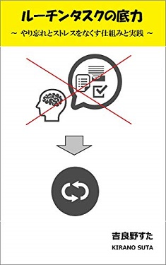

# 制作物(書籍・記事)
[制作物(プログラム) についてはこちら](works.md)

## 電子書籍

### 「ファイル名を指定して実行」のすべて

[Amazon.co.jp： 「ファイル名を指定して実行」のすべて](https://www.amazon.co.jp/dp/B07JF3BHP5/)

Windows の「ファイル名を指定して実行」について、実用的なテクニックから知られざる小ネタまでカバーした一冊です。

Windows をもっと便利に使いたい方、操作効率を上げて仕事をスピードアップしたい方、Windows の仕組みや考え方を知りたい方、小ネタを集めたい方など、初心者から上級者まで幅広くお読みいただけます。

### ルーチンタスクの底力 ～やり忘れとストレスをなくす仕組みと実践～

[Amazon.co.jp： ルーチンタスクの底力: やり忘れとストレスをなくす仕組みと実践](https://www.amazon.co.jp/dp/B07MJW8MVD)

何かと慌ただしく忙しい現代では「あー、あれやるの忘れてた」「あと何をやればいいんだっけ」といったやり忘れやストレスを抱えています。本書では、この問題を解決する仕組みと実践方法について紹介します。

(具体的に) 仕事や私生活は多数のルーチンワーク（繰り返し行う「決まりきった作業」）から成ります。本書ではこれを「ルーチンタスク」という単位で捉え、この「ルーチンワーク」をいかにして管理するか、という視点で考え方や仕組みを構築していきます。

タスク管理未経験者の方でも読み進められるよう、平易な解説を心がけました。また実際に手を動かしていただく演習も用意しています。習得は一朝一夕には行きませんが、習得できれば「まるで自分専用の秘書がいるかのような」利便を手に入れることができます。忙しい学生やサラリーマンの方はもちろん、主婦や自営業の方にもおすすめです。

[試し読みはこちら](https://stakiran.github.io/ebook_power_of_routinetask/)

### 執筆を効率化したい人のための秀丸エディタ実践入門

[Amazon.co.jp： 執筆を効率化したい人のための秀丸エディタ実践入門](https://www.amazon.co.jp/dp/B07R6FTSMT)

「執筆効率を高めるには基礎が必要」という視点で解説した、秀丸エディタの入門書です。既に何らかのエディタで執筆している方を対象にしています。

一段上の執筆ライフを手に入れたい方。「とりあえず」や「なんとなく」でも効率化してみたい方。秀丸エディタの多機能さを前に重たい腰が上がらない方。既に別の手段を使っているけど、もっと効率的な手段やアイデアについて知りたい方――そんなあなたに贈る、ありそうでなかった実践ガイドです。

[試し読みはこちら](https://stakiran.github.io/ebook_hidemarueditor/)

## ブログなど

| 開始日     | タイトルとリンク | キーワード |
| ---------- | ---------------- | ---------- |
| 2017/09/14 | [stamemo](http://stakiran.hatenablog.com/) | ソフトウェア技術, 備忘録 |
| 2018/07/03 | [タスク管理に恋してる](https://ilovetaskmanagement.hatenablog.com/) | タスク管理, 概念, 理論, ツール |
| 2018/10/27 | [ストレスフリーなソロ充ライフ](https://stressfree-fulfilling-solo.hatenablog.com/) | 雑記ブロガー, ライフハック, 多趣味 |
| 2019/02/23 | [Monolithic](https://stakiran.github.io/monolithic/) | 研究, 持論, 仕事術 |
| 2019/07/10 | [statil](https://statil.hatenablog.com/) | TIL(Today I Learned), 雑記, 備忘録 |
